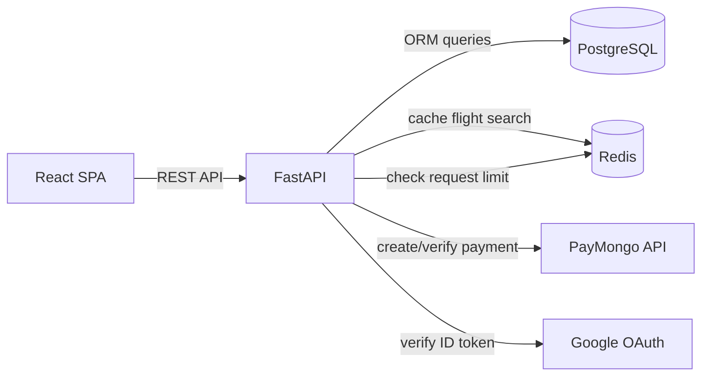

# Skylink — Flight Booking & Reservation Management API

🔗 **[Live Demo](#)** · 🎬 **[Demo Video](#)** · 💻 **[Frontend Repo](#)**

## What It Does
Booking a flight and then trying to manage it — reschedule, cancel, track a PNR, pay — often means dealing with a patchwork of systems that don't talk to each other. Skylink is a backend API that handles the full lifecycle of a flight booking in one place: search and pricing, seat-class inventory, passenger details, payments via PayMongo, rescheduling and cancellation with audit history, and role-based access for passengers and admins.

---

## Key Features

- **Role-based access** — Admins and Passengers each see a different scope of data and actions.
- **Flight search & booking** — search available flights and book a seat with passenger details in a few steps.
- **Manage bookings** — reschedule or cancel a trip anytime, with a full history kept for reference.
- **Secure payments** — pay for a booking online, with automatic confirmation once payment goes through.
- **Sign in your way** — log in with Google or with a regular email and password, with OTP verification for new accounts.
- **Promo codes** — apply discount codes to lower the price of a booking.
- **PNR lookup** — check a booking's status anytime using its reservation reference.
- **Admin dashboard** — manage flights, bookings, users, and promotions from one place.

---

## Architecture Overview



---

## Tech Stack

| Layer | Technology |
|-------|------------|
| Backend | Python, FastAPI, PostgreSQL, SQLAlchemy, Alembic, Pytest, asyncio, SlowAPI |
| Frontend | React, TypeScript, TanStack, Zod, Zustand, Axios, React Hook Form, TailwindCSS |
| Auth | JWT, Google OAuth, bcrypt password hashing, OTP email verification |
| Security | Role-based dependencies, Rate limiting, CORS, Trusted Host, ORM-protected SQL, PayMongo webhook signature verification |
| Performance | Redis (cache + rate limiting), end-to-end pagination, Tanstack Query, database indexes |
| Deployment | Render, Vercel, Supabase |

---

## API & Structure

- **Architecture**: Monolithic FastAPI backend, layered `routers → services → schemas → models`
- **Endpoints**: 65 REST endpoints across 15 relational tables
- **Validation**: End-to-end type-safe validation — Zod (frontend) → Pydantic (backend) → SQLAlchemy ORM (database)
- **Security middleware**: CORS, trusted host, custom security headers (HSTS, X-Frame-Options, X-Content-Type-Options)
- **Rate limiting**: Per-endpoint limits via SlowAPI, Redis-backed with automatic in-memory fallback if Redis is unavailable
- **Caching**: Redis-backed caching on flight search results, invalidated on writes (create/update/cancel)
- **Auth**: JWT-based sessions, Google OAuth login/register, OTP email verification, password reset flow
- **Payments**: PayMongo payment intents with webhook signature verification (test/live mode)
- **Migrations**: Alembic-managed, version-controlled schema history
- **Testing**: 306 Pytest tests covering routers, services, and business logic

---

## Local Setup

### Prerequisites
- Python 3.12+
- Node.js for the frontend

### Backend
1. Clone the repo and navigate into it
```bash
git clone https://github.com/edrian-a-marinas/skylink-api.git
cd skylink-api
```
2. Create a virtual environment and install dependencies
```bash
python3 -m venv venv && source venv/bin/activate   # venv\Scripts\activate on Windows
pip install -r requirements.txt
```
3. Copy the environment template and fill in your values
```bash
cp .env.example .env
```
4. Run database migrations

> **Note:** This project's migrations include Supabase-specific RLS policies (using `auth.role()`), which require a Supabase-backed database. If `DATABASE_URL` points to plain local PostgreSQL (not Supabase), this step will fail with `schema "auth" does not exist`. The API itself (step 5) runs fine regardless — this only affects the RLS-related migrations.

```bash
alembic upgrade head
```
5. Start the API server
```bash
uvicorn app.main:app --reload
```
API available at `http://localhost:8000/docs`

### Frontend
1. Clone the repo and navigate into it
```bash
git clone https://github.com/edrian-a-marinas/skylink-client.git
cd skylink-client
```
2. Install dependencies
```bash
npm install
```
3. Copy the environment template and fill in your values
```bash
cp .env.example .env.local
```
4. Start the dev server
```bash
npm run dev
```
5. App available at `http://localhost:5173`

---
## Congrats, App Running! 🎉

